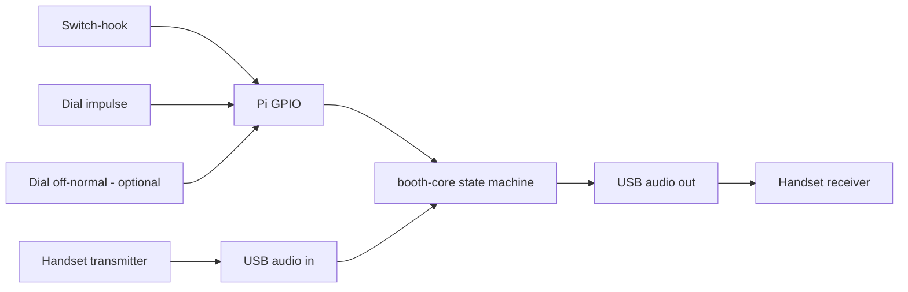

# Payphone hardware reference

This page is a reference for the **physical telephone** the booth is built from —
a vintage **three-slot coin payphone**. It explains what every subsystem is,
where it lives in the cabinet, which subsystems the Rust client actually uses,
and where to find the original service manuals.

For the Pi-side wiring (GPIO pins, pull-ups, audio interface) see
[`hardware.md`](hardware.md). This page is the "what am I looking at inside the
booth" companion to it.

## What this phone is

The reference unit is a **Northern Electric `233`** — the Canadian-built twin of
the **Western Electric `233G`** — a three-slot (`5¢` / `10¢` / `25¢`) coin
telephone from the 1960s. Configurations varied: some `233`-type sets were
minimal (no internal network or ringer, a five-lead dial, paired with an external
subscriber set such as a `685A`). **This cabinet has no telephone (call) ringer
at all.** The only bell inside is the single-stroke **coin signal gong** struck by
the coin mechanism — a different thing that is easy to mistake for a ringer (see
[Ringer](#ringer) and [Coin signal gong](#coin-signal-gong)).

The **brighter, newer wires** you can see mixed in with the older harness are
**not** factory wiring and **not** a previous owner's conversion — they are from
the **last time this booth was installed for this project**. In other words they
are a prior version of exactly the tap harness you are recreating now, so they are
a head start, not a mystery: follow them and they should already land on (or very
near) the hook, dial, and handset contacts. Verify each one anyway — see
[Tracing your previous tap harness](#tracing-your-previous-tap-harness).

## Identifying your unit

These are the part markings observed on this specific cabinet. Yours may differ;
use them as a starting point, not gospel.

| Marking            | On which part            | What it is                                                       |
| ------------------ | ------------------------ | --------------------------------------------------------------- |
| `233` / `233HS`    | Network / terminal block | The set type — a 3-slot coin telephone (WE `233G` twin).        |
| `P-13E961`         | Rotary dial              | The rotary dial assembly part number.                           |
| `P349754`          | Coin relay / totalizer   | The coin-relay (totalizer) assembly in the lower compartment.   |

## Service manuals and diagrams

There **is** documentation on the web. These are the most useful, in rough order
of how directly they apply to this cabinet. The hand-drawn `233G` wiring diagram
is **bundled in this repo** ([`reference/233g_wiring.pdf`](reference/233g_wiring.pdf))
so it survives even if the source site disappears; the rest are external links
(the in-repo link checker runs offline and does not verify external URLs).

| Resource                                                                                                  | What it covers                                                                                  |
| --------------------------------------------------------------------------------------------------------- | ----------------------------------------------------------------------------------------------- |
| [233G wiring diagram — hand-drawn PDF](reference/233g_wiring.pdf) (bundled; [source](https://memorial.bellsystem.com/pdf/233g_wiring.pdf)) | The single most useful sheet: how a `233G`'s contacts, network, and coin relay interconnect.    |
| [233G restoration project (David Massey)](https://memorial.bellsystem.com/telephones-payphones-233G.html) | Photo-by-photo teardown of every subsystem — coin relay, switch-hook, ringer, terminal strip.   |
| [Northern Electric 233 conversion](https://www.islandregister.com/phones/ne233.html)                      | Your exact model: wiring an NE `233` for an ordinary line, terminal by terminal.                |
| [WE 200-series network terminals (Stan Schreier)](https://www.antiquetelephonehistory.com/we200payphones.php) | Terminal designations for converting the network block (`B`, `R`, `C`, `RR`, `GN`).         |
| [External payphone controller (Doug Alderdice)](https://www.thompdale.com/payphone/payphone.htm)          | The closest analog to this project — driving a 3-slot phone from external electronics.           |
| [Bell System Coin Service Manual, Dec 1972](https://archive.org/details/Bell_System_Coin_Service_Manual_Dec_1972) | Authoritative coin-set theory: dial shorting, coin relay, totalizer, signal gongs.       |
| [TCI Library](https://www.telephonecollectors.info/)                                                      | Scanned Bell System Practices — search BSP Division `506` (coin telephones) for the `233`.       |

Print the bundled [`reference/233g_wiring.pdf`](reference/233g_wiring.pdf) and keep
it next to the booth while you trace contacts — every terminal-letter reference
below is easier to confirm against that sheet plus a multimeter. (That PDF is a
hand-drawn diagram from David Massey's `233G` restoration site, archived here for
resilience; credit and context are on the [restoration page](https://memorial.bellsystem.com/telephones-payphones-233G.html).)

## Subsystem breakdown

| Subsystem                   | Where it lives                         | Key parts / terminals                              | Used by the booth?                         |
| --------------------------- | -------------------------------------- | -------------------------------------------------- | ------------------------------------------ |
| Line / network block        | Top housing, terminal strip            | `233HS` block (`L` / `TR` / `T`), induction coil   | No — bypassed                              |
| Rotary dial                 | Top housing, front                     | `P-13E961`; impulse + off-normal contacts          | **Yes** — pulse required, off-normal optional |
| Switch-hook                 | Back plate, behind the cradle          | Leaf-spring contact pile-up                        | **Yes** — required                         |
| Ringer (call bell)          | Not fitted in this cabinet             | None — there is no call ringer (see note)          | n/a — none present                         |
| Coin chute / relay / hopper | Lower (vault) compartment              | Coin relay `P349754`, hopper, coin-trigger contact | No (optional coin input — see below)       |
| Coin signal gong            | Coin chassis, by the coin relay        | Single brass gong struck by the coin mechanism      | No                                         |
| Handset                     | On the cradle                          | Transmitter capsule, receiver capsule               | **Yes** — both feed the audio interface    |

### Line and network block

The `233HS` terminal block (terminals commonly lettered `L`, `TR`, `T`) is where
the line landed and, on sets that have one, where the induction coil /
anti-sidetone network sits. The booth does **not** use the telephone network at
all — audio goes straight from the handset capsules to the USB audio interface —
so this block is only useful as a convenient, labelled place to find the line,
dial, hook, and handset leads before you tap them.

### Rotary dial

The `P-13E961` dial has two contact sets that matter:

- **Impulse (pulse) contacts** — open once per "click" as the finger wheel
  returns. This is the only dial signal the booth strictly needs; the client
  counts pulses to decode a digit.
- **Off-normal (shunt) contacts** — closed the whole time the wheel is away from
  rest. Historically these mute the receiver while dialling. The booth can read
  them for debugging but does **not** need them to decode digits (see
  [`hardware.md`](hardware.md#rotary-phone-wiring)).

### Switch-hook

A leaf-spring contact pile-up on the back plate, operated by the handset cradle.
The booth taps one set of these contacts to know whether the handset is up or
down — this is **required**.

### Ringer

A telephone **call ringer** is a coil with a clapper that buzzes between **two
gongs** at about 20 Hz — the classic "brrring". **This cabinet doesn't have one.**
The brass bell inside is the single-stroke [coin signal gong](#coin-signal-gong),
struck mechanically by the coin mechanism — not a ringer, and it can't be "rung"
with ring voltage.

The booth never receives calls, so it wouldn't use a ringer anyway. If you *want*
the booth to ring, you have to add ringing hardware — either drive a real
(twin-gong) ringer with a SLIC such as a Silvertel `Ag1171`, or strike a gong
with a solenoid from a spare GPIO. A single gong gives a clean "ding" but not the
authentic two-tone warble of a real ringer. See
[Optional: making the booth ring](#optional-making-the-booth-ring) for the full
hardware and software breakdown.

### Coin chute, relay, and hopper

Coins fall through the chute past the **coin-trigger contact** (a ground contact,
often the yellow wire on the `G` terminal) and into the **hopper**, held until
the **coin relay / totalizer** (`P349754`) either collects them to the vault or
returns them. The relay also **shorts the dial** until payment is detected, which
is how a real coin phone blocks free calls.

The booth has **no concept of coins** — there is no coin event anywhere in the
software — so the entire coin path is unused. The one thing you *could* do is tap
the coin-trigger contact as an extra GPIO input to detect a dropped coin, but
there is nothing in `booth-core` to consume it today; treat that as a future
enhancement, not a wiring requirement.

### Coin signal gong

The single brass gong by the coin relay sounds the classic coin tones (a "ding"
as coins are deposited) so a far-end operator could hear what was paid. It is
struck **mechanically** by the coin mechanism — this is the bell that is easy to
mistake for a call ringer, but it is **not** one and cannot be driven with ring
voltage. Unused by the booth, though you could tap it with a solenoid for a
"ding" sound effect (see [Ringer](#ringer)).

### Handset

Two **separate** capsules under the screw-off caps:

- the **transmitter** (mouthpiece) is the microphone — usually a carbon element;
- the **receiver** (earpiece) is the speaker.

Both go to the **USB audio interface**, not to GPIO. Carbon transmitters need
DC bias and are low-fidelity; the receiver is a narrow-band, low-sensitivity
element. Options for improving or replacing each — electret swaps, drop-in
capsules, small amplifiers, source-side EQ — are covered in
[`hardware.md`](hardware.md#handset-transmitter-and-receiver).

## What the booth actually uses

Of everything above, the Rust client touches just **five** things: three switch
contacts to GPIO and the two handset capsules to the audio interface.



Everything else — the line/network block, the coin relay, hopper, and the coin
signal gong — is left in place but electrically idle.

## Subsystem map

Roughly where each subsystem sits in the cabinet:

```text
+---------------------- 3-slot coin payphone (NE 233 / WE 233G) ----------------+
| TOP HOUSING (upper compartment)                                              |
|   * Coin slots: 5 / 10 / 25 cents  -> coin chute -> hopper -> coin relay      |
|   * Terminal / network block  (233HS):  L / TR / T  + induction coil         |
|   * No call ringer fitted in this cabinet                                    |
|   * Rotary dial (P-13E961): impulse + off-normal contacts                     |
|   * Switch-hook leaf-spring pile-up (on the back plate)                       |
|                                                                              |
| LOWER COMPARTMENT (vault)                                                      |
|   * Coin relay / totalizer (P349754) under the plastic "hat"                  |
|   * Coin hopper + coin-trigger contact (G terminal, yellow ground wire)       |
|   * Coin box / vault                                                          |
|                                                                              |
| HANDSET (on the cradle)                                                        |
|   * Transmitter capsule (carbon mic)     * Receiver capsule (earpiece)        |
+------------------------------------------------------------------------------+
```

## Wiring it to the Pi

The five taps the booth needs, and where each lands:

```text
  Switch-hook contact ------------> GPIO  hook   (BCM 17 / phys 11)   [required]
  Dial impulse contact -----------> GPIO  pulse  (BCM 27 / phys 13)   [required]
  Dial off-normal contact --------> GPIO  gate   (BCM 22 / phys 15)   [optional]
  Common / contact return --------> Pi GND (phys 9)
  Handset transmitter (mic) ------> USB audio interface  INPUT
  Handset receiver (earpiece) ----> USB audio interface  OUTPUT
```

The GPIO pin numbers, pull-up direction, polarity inversion, and the legacy
Node.js harness remap all live in [`hardware.md`](hardware.md#rotary-phone-wiring)
and [`configuration.md`](configuration.md). Bring the booth up with the
[debug pin matrix](debug-panel.md) open and watch the live levels while you lift
the handset and dial, so you can confirm each contact before trusting it.

## Tracing your previous tap harness

The **brighter / newer wires are your own previous installation** — the tap
harness from the last time this booth was wired up. They are the map you are
recreating, and they most likely already land on the contacts below. Still,
confirm every tap with a meter before trusting it (a wire can come loose, or land
on the wrong leaf):

1. Power the phone **off** and use a multimeter in continuity mode.
2. Find the **switch-hook** contact: continuity should toggle as you press and
   release the cradle. That leaf pair is your `hook` tap.
3. Find the **dial impulse** contact: continuity should pulse open the number of
   times you dial (dial `0` = ten pulses). That pair is your `pulse` tap.
4. Find the **dial off-normal** contact: continuity should stay closed only while
   the wheel is away from rest. Optional `gate` tap.
5. Identify the **handset transmitter and receiver** leads at the terminal block
   or handset cord, and run them to the audio interface.
6. Pick one **common return** for the three switch contacts and bring it to a Pi
   ground pin.

Cross-check each contact against the bundled
[`reference/233g_wiring.pdf`](reference/233g_wiring.pdf) so you
know which terminal letters you are landing on, then record the colours you
actually found for this cabinet — they will not necessarily match the "typical"
colours in [`hardware.md`](hardware.md).

## Optional: making the booth ring

**Optional / aspirational — you probably won't do this.** Nothing in the software
rings today, and this cabinet has no call ringer, so treat everything here as an
"if you ever feel like it" add-on, not a wiring requirement.

The booth never receives calls, so it has no reason to ring. But if you wanted an
incoming-call or attract-attention *chime*, there are two hardware routes, plus
some software work that does not exist yet.

### Strike the existing coin gong with a solenoid

Cheapest, and most in keeping with the cabinet. A small push-solenoid taps the
single brass [coin signal gong](#coin-signal-gong). Expect a clean single-note
"ding", not the two-tone warble of a real ringer — one gong is one pitch.

- Use a short-throw (3–5 mm) push-solenoid and tap the **rim** of the dome, never
  the bolted centre (the centre is dead and just goes "tunk").
- There is no ready-made mounting boss by the gong: bend a small L-bracket and
  anchor it to a relay-frame screw, the silver-plate rivets below the gong, or
  straight into the cabinet wall on the open right-hand side.
- Drive it from a spare GPIO through a logic-level **MOSFET + flyback diode** on
  its **own 5–12 V supply** — not the Pi's 3V3 rail.
- Pulse it on a real ring cadence (2 s on / 4 s off) at roughly 5–10 Hz; small
  solenoids turn buzzy and weak as you approach a true 20 Hz.

**Shortcut worth metering first:** the gong already has a clapper thrown by the
coin-relay coil, and that coil *is* a solenoid. You may be able to pulse the
original coil and reuse the factory striker with no bracket to fabricate. Confirm
with a meter which leads fire the striker (versus coin collect/return), expect a
~48 V coil that was never meant for sustained pulsing, and drive it through the
same MOSFET-plus-flyback arrangement.

### Fit a real ringer driven by a SLIC

For the authentic warble, add a salvaged **twin-gong ringer** (two gongs + biased
clapper) and drive it with a Silvertel **`Ag1171`** SLIC, which makes ring voltage
(~40–90 Vrms, 20–25 Hz) from a 3.3–5 V supply:

- Wire the ringer across the SLIC's **TIP / RING** output, in series with a
  **~0.47 µF** non-polarised capacitor — without it the SLIC sees a permanent
  off-hook.
- Toggle the SLIC's **RM** (ring-mode) pin from a GPIO to start, stop, and shape
  the cadence; read its **SHK** pin if you also want off-hook detection.
- Power the SLIC from its **own 5 V** (not the Pi 3V3), share only logic ground,
  and keep the high-voltage ring side clear of Pi grounds.

### Software support needed (either route)

There is no ringing path in the code today: `GpioPort` in `booth-hal` is
**input-only** and `booth-core` has no output effect. To ring from the app you
would add:

- a new output `Effect` variant in `booth-core` (e.g. `StartRing` / `StopRing`);
- an output method on a HAL trait (a writable GPIO, or a dedicated ringer port);
- a `booth-pi` implementation (an `rppal` `OutputPin`, Linux-gated, with a macOS
  stub) and the runtime wiring in `booth-bin`;
- almost certainly an **ADR**, since this adds an output effect to a core that is
  deliberately input-only (`handle(State, Event) -> (State, Vec<Effect>)`).

Until that lands, any of the hardware above has to be driven by a separate
script rather than the booth client.
